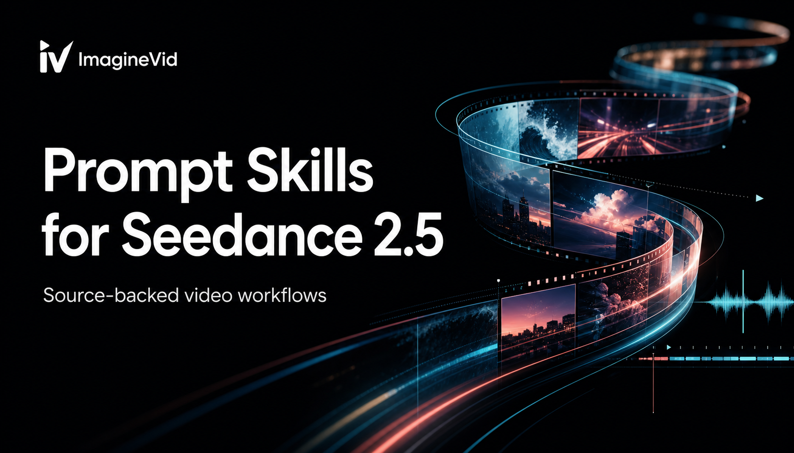

<a href="https://github.com/imagineVid/Awesome-seedance-2-5-prompts-and-skills">
  
</a>

> Weryfikowalna źródłowo biblioteka briefów ujęć, wzorców ruchu i audiowizualnych workflowów dla Seedance 2.5.
# Awesome Seedance 2.5: prompty i umiejętności

[](https://github.com/sindresorhus/awesome)
[](https://github.com/imagineVid/Awesome-seedance-2-5-prompts-and-skills)
[](https://creativecommons.org/licenses/by/4.0/)
[](https://github.com/imagineVid/Awesome-seedance-2-5-prompts-and-skills/actions)
[](docs/CONTRIBUTING.md)

> Przestudiuj brief, obejrzyj rezultat, znajdź twórcę i wykorzystaj ponownie logikę reżyserską zamiast kopiować samą powierzchowną stylistykę.

> **Atrybucja i poprawki:** każdy opublikowany przykład prowadzi do twórcy i kanonicznego źródła. Prawa pozostają przy właścicielach. Otwórz issue, aby zmienić atrybucję lub usunąć materiał.

---

[](README.md) [](README.es.md) [](README.pt.md) [](README.it.md) [](README.de.md) [](README.fr.md) [](README.ar.md) [](README.ja.md) [](README.ko.md) [](README.zh.md)
[](README.nl.md) [](README.ru.md) [](README.tr.md) [](README.pl.md)

---

## Twórz z Seedance 2.5

**[Otwórz workflow Seedance 2.5 w ImagineVid](https://imaginevid.io/seedance-2-0)**

To repozytorium opiera się na dowodach, a nie na szumie wokół premiery. Do czasu powstania osobnej strony Seedance 2.5 odnośnik ImagineVid otwiera dostępny workflow Seedance 2.0.

Informacja o premierze nie jest dowodem modelu. Przypadek trafia do zbioru tylko wtedy, gdy źródło wyraźnie wskazuje Seedance 2.5 i udostępnia dość promptu oraz wideo, by pokazać powtarzalny wzorzec.

| Potrzeba produkcyjna | Biblioteka dowodów | Workflow ImagineVid |
|---------|--------------|---------------------|
| Przegląd przykładu | Prompt, rezultat i źródło | Generuj i porównuj |
| Odkrywanie | Wyszukiwanie tekstu w repozytorium | Eksploracja prowadzona przez workflow |
| Generowanie | - | Otwórz Seedance 2.5 |
| Czytanie | Markdown natywny dla GitHub | Przeglądarkowa przestrzeń produkcyjna |
| Workflowy wideo | - | Filtry produkcyjne |


### Przeglądaj według workflowu produkcyjnego

- [**Reżyseria referencji multimodalnych**](#workflow-multimodal-reference-direction) - Przypisz zadanie każdej referencji - Określ, które wejście steruje tożsamością, kompozycją, ruchem, dźwiękiem lub obróbką wizualną
- [**Blocking i trasy kamery w długich ujęciach**](#workflow-long-take-blocking-camera-paths) - Briefy ujęć oparte na kadrowaniu, trasie kamery, blockingu, tempie, ujawnieniach i przejściach.
- [**Timing dialogu, Foley i muzyki**](#workflow-dialogue-foley-music-timing) - Prompty oparte na występie, w których mowę, aktorstwo, atmosferę, muzykę lub zsynchronizowany dźwięk niesie scena.
- [**Ciągłość narracji i gra postaci**](#workflow-narrative-continuity-character-performance) - Zapisz ciągłość jako ograniczenie - Chroń tożsamość, kostium, geometrię produktu, przestrzeń i oświetlenie
- [**Ruch produktu, mody i kampanii**](#workflow-product-fashion-campaign-motion) - Klipy komercyjne, które stawiają produkt, ofertę, ubranie, danie, urządzenie lub moment marki w centrum ruchu.
- [**Edycja, wydłużanie i restyling wideo**](#workflow-video-editing-extension-restyling) - Workflowy istniejącego wideo, które restylizują, wydłużają, dodają, usuwają, zastępują lub przekierowują część sceny przy ochronie ciągłości.

---

## Spis treści

- [Twórz z Seedance 2.5](#twórz-z-seedance-25)
- [Czym jest Seedance 2.5?](#czym-jest-seedance-25)
- [Status kolekcji](#status-kolekcji)
- [Wyróżnione prompty wideo](#community-featured-prompts)
- [Prompty wideo społeczności](#community-prompt-cases)
- [Dodaj zweryfikowany przykład](#dodaj-zweryfikowany-przykład)
- [Licencja](#licencja)
- [Kredyty twórców](#kredyty-twórców)
- [Rozwój repozytorium](#rozwój-repozytorium)

---

## Czym jest Seedance 2.5?

**Seedance 2.5** to nazwa kolejnej wersji modelu wideo Seedance, ujawnionej w doniesieniach z lipca 2026 roku. Publiczny katalog modeli Seed firmy ByteDance nie zawiera jeszcze pełnej karty modelu, stabilnego identyfikatora API ani szczegółowej publicznej specyfikacji Seedance 2.5. Repozytorium oddziela więc potwierdzone materiały pierwotne od twierdzeń społeczności i zaktualizuje zakres, gdy ByteDance opublikuje trwałą dokumentację.

Biblioteka skupia się na tym, co można sprawdzić w rzeczywistym wyniku: roli referencji, widocznej akcji, trasie kamery, rytmie, dialogu i dźwięku, ograniczeniach ciągłości oraz intencji montażowej. Liczbowe deklaracje możliwości pozostają poza zbiorem, dopóki nie można ich powiązać ze stabilnym źródłem pierwotnym.

- **Przypisz zadanie każdej referencji** - Określ, które wejście steruje tożsamością, kompozycją, ruchem, dźwiękiem lub obróbką wizualną
- **Opisz widoczną przyczynę i skutek** - Połącz każdą akcję z ruchem, reakcją lub zmianą otoczenia widoczną dla odbiorcy
- **Rozpisz scenę na rytmy** - Uporządkuj obserwowalne momenty zamiast streszczać historię
- **Wyreżyseruj ścieżkę dźwiękową** - Wskazuj dialog, Foley, atmosferę i muzykę tylko tam, gdzie rozwijają scenę
- **Nazwij trasę kamery** - Określ kadrowanie, ruch, odległość od obiektu i przejścia między ważnymi ujęciami
- **Zapisz ciągłość jako ograniczenie** - Chroń tożsamość, kostium, geometrię produktu, przestrzeń i oświetlenie

**Aktualne odnośniki:** [Seedance 2.5 release reporting](https://www.theinformation.com/briefings/bytedance-unveils-seedance-2-5-video-model) · [ByteDance Seed model catalog](https://seed.bytedance.com/en/models) · [Available Seedance workflow on ImagineVid](https://imaginevid.io/seedance-2-0)

### Zamień prompt w szablon ujęcia

Wielokrotnego użytku prompty wideo oddzielają zmienne sceny od logiki reżyserskiej. Zmień temat, miejsce, wypowiadane zdanie lub produkt, zachowując sprawdzoną trasę kamery, strukturę beatów, plan dźwiękowy i reguły ciągłości.

**Wzorzec szablonu:**
```
[DURATION + ASPECT RATIO]. [SUBJECT] performs [VISIBLE ACTION] in [SETTING]. Camera: [FRAMING + MOVE]. Beats: [TIMED ACTIONS]. Audio: [DIALOGUE + FOLEY + AMBIENCE]. Preserve: [IDENTITY / PRODUCT / LAYOUT]. Avoid: [FAILURE MODES].
```

Zacznij od jednej akcji i jednego pomysłu na kamerę. Dodawaj timing, audio i ograniczenia zachowania tylko wtedy, gdy rozwiązują widoczną potrzebę produkcyjną; potem między generacjami zmieniaj jedną zmienną naraz.

---

## Status kolekcji

<div align="center">

| Pole kolekcji | Bieżąca wartość |
|--------|-------|
| Zweryfikowane przykłady | **6** |
| Wybór redakcji | **2** |
| Wygenerowano | **czwartek, 23 lipca 2026 03:19:03 UTC** |

</div>

---

<a id="community-featured-prompts"></a>

## Wyróżnione prompty wideo

> Wybrane pod kątem odtwarzalności, czytelności ruchu i użyteczności produkcyjnej

<a id="prompt-1"></a>

### #1: Rowerowa przejażdżka w złotej godzinie po cichych ulicach


#### Dlaczego ten workflow ma znaczenie

Zwięzły brief utrzymujący czytelność rowerzystki i płynnego ruchu kamery w naturalnym świetle zwykłej dzielnicy.

#### Prompt źródłowy

```
A young East Asian woman riding a bicycle through quiet city streets, casually exploring the neighborhood, cinematic, natural daylight, realistic, smooth camera movement.
```

#### Wideo

<div align="center">
<a href="https://video.twimg.com/ext_tw_video/2074956835250122752/pu/vid/avc1/1280x720/GGVJY84yqzPpP7dZ.mp4?tag=26"></a>

*Kliknij podgląd, aby otworzyć wideo* · **[▶ Obejrzyj wideo →](https://video.twimg.com/ext_tw_video/2074956835250122752/pu/vid/avc1/1280x720/GGVJY84yqzPpP7dZ.mp4?tag=26)**
</div>

#### Dowody

- **Twórca:** [@noorwithwifi](https://x.com/noorwithwifi)
- **Źródło kanoniczne:** [Źródło kanoniczne](https://x.com/noorwithwifi/status/2074956913075491029)
- **Opublikowano:** 8 lipca 2026
- **Język promptu:** en

**[Utwórz z tym kierunkiem · ImagineVid](https://imaginevid.io/seedance-2-0)**

---

<a id="prompt-3"></a>

### #2: Industrialna walka z dwiema referencjami i czasowanymi uderzeniami


#### Dlaczego ten workflow ma znaczenie

Gęsty brief akcji koordynujący dwóch zawodników, blocking, zmiany kamery, zwolnienia, uderzenia i reakcje otoczenia przez czternaście sekund.

#### Prompt źródłowy

```
Aesthetic Tone: A stark industrial wasteland style featuring low-saturation cool grays and steel-blue hues, contrasted with the heavy, rugged textures of industrial machinery. Lighting & Shadow: Intense overhead lighting (mimicking a cage fight) casts sharp, deep shadows across the concrete floor and the characters' faces, emphasizing a sense of raw power.

[Timeline: Detailed Action & Camera Instructions]

00:00-00:01 | Pre-fight Standoff
[Combat Action]: @ Image1 and @ Image2 assume low-center-of-gravity fighting stances; their muscles are taut and tense.
[Camera Technique]: A horizontal pan (medium shot) sweeps from right to left across both characters, establishing the space of confrontation.
[Visual Effects]: Semi-transparent "GAME START" text floats in mid-air, featuring a metallic sheen and worn, distressed edges.

00:01-00:03 | Flying Kick & Cross-Arm Block
[Combat Action]: @ Image1 rapidly launches a fierce high side-kick at a 45-degree upward angle. @ Image2 instantly slides sideways, crossing arms into a shield-like "X" formation to block the incoming kick with solid, bone-jarring force.
[Camera Technique]: A whip zoom locks onto the point of impact, transitioning to slow motion (quarter speed) at the exact moment the leg and arms collide.
[Visual Effects]: The point of impact triggers a visible air-distortion ripple, accompanied by a scattering of sparks and dust particles generated by the friction.

00:03-00:06 | Close-Quarters Blitz & Facial Impact
[Combat Action]: After absorbing the blow, @ Image2 immediately counters with a rapid-fire "one-inch punch" combo, striking from both left and right. @ Image1 dodges hastily. @ Image2 follows through with a powerful right hook, fueled by hip rotation, that slams into @ Image1's left cheek, causing facial distortion and sending a spray of saliva and blood droplets flying.
[Camera Technique]: Handheld camera work sways with the body, creating a documentary-style shaky-cam aesthetic; micro-second screen shake marks the moment of a heavy punch impact.
[Visual Effects]: High-frequency "impact frames" (staccato light and shadow flashes) occur the instant the face is struck; sweat appears as glowing particles under side lighting.

00:06-00:10 | Pursuit and Liver-Targeting Knee Strike
[Action]: @ Image2 denies the opponent a chance to recover, stepping in to close the distance; the right hand hooks the back of @ Image1's neck and pulls downward while the right knee drives violently upward, delivering a knee strike to the liver. @ Image1 retches, body arching and curling in pain.
[Camera Technique]: Extreme low-angle shot looking upward to emphasize the power and impact of the knee strike.
[Visual Effects]: Realistic fabric indentation and intense creasing appear the moment the knee makes contact.

00:10-00:12 | Head-Clinch Slam
[Action]: @ Image2 locks both hands around @ Image1's head, twists the torso with leg-driven power, and executes a 180-degree arc throw, slamming @ Image1's head and upper body against the concrete ground.
[Camera Technique]: Rapid tilt down; the camera tracks the trajectory of the falling figure.
[Visual Effects]: On impact, localized cracks appear on the ground and a dense cloud of dust and grit explodes outward.

00:12-00:14 | Final Struggle
[Action]: @ Image1 lies in the dust, curled in pain; the right hand weakly clutches the abdomen, the chest heaves with labored breathing, and the eyes lose focus.
[Camera Technique]: Slow overhead close-up; the camera rotates slightly and pulls back with a crane move.
[Visual Effects]: Realistic airborne dust particles float in front of the lens, with subtle film grain across the image.
```

#### Wideo

<div align="center">
<a href="https://video.twimg.com/amplify_video/2077336525373923328/vid/avc1/1920x1080/wlKvDYYr__Dylt21.mp4?tag=28"></a>

*Kliknij podgląd, aby otworzyć wideo* · **[▶ Obejrzyj wideo →](https://video.twimg.com/amplify_video/2077336525373923328/vid/avc1/1920x1080/wlKvDYYr__Dylt21.mp4?tag=28)**
</div>

#### Dowody

- **Twórca:** [@AIReelofficial](https://x.com/AIReelofficial)
- **Źródło kanoniczne:** [Źródło kanoniczne](https://x.com/AIReelofficial/status/2077729460644872389)
- **Opublikowano:** 16 lipca 2026
- **Język promptu:** en

**[Utwórz z tym kierunkiem · ImagineVid](https://imaginevid.io/seedance-2-0)**

---

<a id="community-prompt-cases"></a>

## Prompty wideo społeczności

> Sortowane według daty źródła i wartości redakcyjnej.

<a id="workflow-multimodal-reference-direction"></a>

### Reżyseria referencji multimodalnych (1)

Przypisz zadanie każdej referencji - Określ, które wejście steruje tożsamością, kompozycją, ruchem, dźwiękiem lub obróbką wizualną

**Wyróżnione prompty wideo**

- [Industrialna walka z dwiema referencjami i czasowanymi uderzeniami](#prompt-3)

<a id="workflow-long-take-blocking-camera-paths"></a>

### Blocking i trasy kamery w długich ujęciach (3)

Briefy ujęć oparte na kadrowaniu, trasie kamery, blockingu, tempie, ujawnieniach i przejściach.

<a id="prompt-2"></a>

#### #1: Cyberpunkowy robot-haker w trzydziestosekundowym ujęciu


##### Dlaczego ten workflow ma znaczenie

Celowo minimalny prompt do analizy, jak jeden bohater, stanowisko pracy i ciągła akcja rozwijają się w długim ujęciu.

##### Prompt źródłowy

```
Cyberpunk hacker robot working in front of many monitors.
```

##### Wideo

<div align="center">
<a href="https://video.twimg.com/ext_tw_video/2077113718106648577/pu/vid/avc1/1280x720/twNk6uhZZRnoFngO.mp4?tag=12"></a>

*Kliknij podgląd, aby otworzyć wideo* · **[▶ Obejrzyj wideo →](https://video.twimg.com/ext_tw_video/2077113718106648577/pu/vid/avc1/1280x720/twNk6uhZZRnoFngO.mp4?tag=12)**
</div>

##### Dowody

- **Twórca:** [@thedoomguy_ai](https://x.com/thedoomguy_ai)
- **Źródło kanoniczne:** [Źródło kanoniczne](https://x.com/thedoomguy_ai/status/2077113772959740310)
- **Opublikowano:** 14 lipca 2026
- **Język promptu:** en

**[Utwórz z tym kierunkiem · ImagineVid](https://imaginevid.io/seedance-2-0)**

---

<a id="prompt-5"></a>

#### #2: Cztery pory roku w jednym ciągłym ujęciu


##### Dlaczego ten workflow ma znaczenie

Redakcyjna rekonstrukcja publicznego pokazu do testowania trzydziestu sekund ciągłości środowiska.

##### Prompt zlokalizowany

```
Stwórz jedno nieprzerwane, 30-sekundowe przejście kamery przez ten sam krajobraz: wiosna zmienia się w lato, lato w jesień, a jesień w zimę. Zachowaj trasę, położenie punktów orientacyjnych i prędkość; naturalnie zmieniaj roślinność, pogodę, światło, podłoże, dźwięk i aktywność ludzi. Ukryj przejścia za pierwszym planem, cząstkami lub uzasadnionym obrotem. Bez cięć, skoków geometrii i zmian tożsamości. Zakończ na tej samej osi kompozycji co początek.
```

<details>
<summary>Oryginalny prompt źródłowy</summary>

```
Create one uninterrupted 30-second camera move through the same landscape as spring transforms into summer, summer into autumn, and autumn into winter. Preserve the exact path, landmark positions, and camera speed while vegetation, weather, daylight, ground texture, ambient sound, and human activity evolve naturally with each season. Hide every transition inside foreground occlusion, drifting particles, or a motivated camera turn. No cuts, no geometry jumps, and no sudden identity changes. End from the same compositional axis established at the beginning.
```

</details>

##### Wideo

<div align="center">
<a href="https://video.twimg.com/amplify_video/2071689424891527168/vid/avc1/1920x1080/aPpOZyVnA973XFrL.mp4?tag=28"></a>

*Kliknij podgląd, aby otworzyć wideo* · **[▶ Obejrzyj wideo →](https://video.twimg.com/amplify_video/2071689424891527168/vid/avc1/1920x1080/aPpOZyVnA973XFrL.mp4?tag=28)**
</div>

##### Dowody

- **Twórca:** [@JSFILMZ0412](https://x.com/JSFILMZ0412)
- **Źródło kanoniczne:** [Źródło kanoniczne](https://x.com/JSFILMZ0412/status/2071692606573277428)
- **Opublikowano:** 29 czerwca 2026
- **Język promptu:** en

**[Utwórz z tym kierunkiem · ImagineVid](https://imaginevid.io/seedance-2-0)**

---

<a id="prompt-6"></a>

#### #3: Lampart zamrożony w skoku przy ruchomej kamerze


##### Dlaczego ten workflow ma znaczenie

Rekonstrukcja publicznego wyniku Seedance 2.5, oddzielająca czas zwierzęcia od czasu kamery dla dramatycznej orbity.

##### Prompt źródłowy

```
Create a 10-second vertical wildlife-commercial shot in a sunlit savanna. A leopard launches across a narrow rocky gap. At the apex of the jump, freeze the leopard completely in time while dust, grass, and the surrounding environment continue moving naturally. The camera does not stop: sweep from a low side-tracking angle into a smooth 180-degree orbit around the suspended animal, revealing detailed fur, focused eyes, stretched anatomy, and the valley beyond. After the orbit, release time and let the leopard land with believable weight as dust rolls past the lens. Maintain one leopard, coherent terrain, correct limb anatomy, natural parallax, warm late-afternoon light, and continuous ambient wind and impact audio. No cuts, no duplicated animal, no frozen background, no text.
```

##### Wideo

<div align="center">
<a href="https://video.twimg.com/ext_tw_video/2079745224570519552/pu/vid/avc1/720x1280/27yst_h2-L4NaPMA.mp4?tag=12"></a>

*Kliknij podgląd, aby otworzyć wideo* · **[▶ Obejrzyj wideo →](https://video.twimg.com/ext_tw_video/2079745224570519552/pu/vid/avc1/720x1280/27yst_h2-L4NaPMA.mp4?tag=12)**
</div>

##### Dowody

- **Twórca:** [jzcreates](https://x.com/jzcreates)
- **Źródło kanoniczne:** [Źródło kanoniczne](https://x.com/jzcreates/status/2079745245713928390)
- **Opublikowano:** 22 lipca 2026
- **Język promptu:** en

**[Utwórz z tym kierunkiem · ImagineVid](https://imaginevid.io/seedance-2-0)**

---

<a id="workflow-dialogue-foley-music-timing"></a>

### Timing dialogu, Foley i muzyki (1)

Prompty oparte na występie, w których mowę, aktorstwo, atmosferę, muzykę lub zsynchronizowany dźwięk niesie scena.

<a id="prompt-4"></a>

#### #4: Mroczny zwiastun przybycia obcych


##### Dlaczego ten workflow ma znaczenie

Krótki, trzydziestosekundowy prompt sprawdzający narastającą tajemnicę, globalną skalę i spójne tempo filmowe.

##### Prompt zlokalizowany

```
Filmowy, mroczny i tajemniczy zwiastun opowieści o przybyciu obcych na Ziemię.
```

<details>
<summary>Oryginalny prompt źródłowy</summary>

```
A cinematic, dark and mysterious trailer for a movie about aliens arriving on Earth.
```

</details>

##### Wideo

<div align="center">
<a href="https://video.twimg.com/amplify_video/2075206120461709312/vid/avc1/1280x720/-Sd8GC06pfI6PfH2.mp4?tag=28"></a>

*Kliknij podgląd, aby otworzyć wideo* · **[▶ Obejrzyj wideo →](https://video.twimg.com/amplify_video/2075206120461709312/vid/avc1/1280x720/-Sd8GC06pfI6PfH2.mp4?tag=28)**
</div>

##### Dowody

- **Twórca:** [@synthwavedd](https://x.com/synthwavedd)
- **Źródło kanoniczne:** [Źródło kanoniczne](https://x.com/synthwavedd/status/2075206446879265049)
- **Opublikowano:** 9 lipca 2026
- **Język promptu:** en

**[Utwórz z tym kierunkiem · ImagineVid](https://imaginevid.io/seedance-2-0)**

---

<a id="workflow-narrative-continuity-character-performance"></a>

### Ciągłość narracji i gra postaci (1)

Zapisz ciągłość jako ograniczenie - Chroń tożsamość, kostium, geometrię produktu, przestrzeń i oświetlenie

**Wyróżnione prompty wideo**

- [Rowerowa przejażdżka w złotej godzinie po cichych ulicach](#prompt-1)

## Dodaj zweryfikowany przykład

Znalazłeś przykład Seedance 2.5, który uczy prawdziwego wzorca reżyserskiego? Prześlij przez GitHub Issues prompt, odtwarzalny rezultat, twórcę, źródło, dowód modelu i tryb wejścia.

### GitHub issue

1. [**Prześlij prompt wideo**](https://github.com/imagineVid/Awesome-seedance-2-5-prompts-and-skills/issues/new?template=submit-prompt.yml)
2. Podaj pełny brief, źródło, twórcę, dowód modelu i odtwarzalne media
3. Maintainer sprawdza pochodzenie, wartość wideo, zakres i duplikaty
4. Zatwierdzone przykłady są normalizowane do lokalnego źródła danych
5. Generator publikuje przykład po przejściu wszystkich kontroli jakości

**Reguła redakcyjna:** Informacja o premierze nie jest dowodem modelu. Przypadek trafia do zbioru tylko wtedy, gdy źródło wyraźnie wskazuje Seedance 2.5 i udostępnia dość promptu oraz wideo, by pokazać powtarzalny wzorzec.

Przed wysłaniem przeczytaj [CONTRIBUTING.md](docs/CONTRIBUTING.md).

---

## Licencja

Tekst redakcyjny i kod ImagineVid są objęte licencją [CC BY 4.0](https://creativecommons.org/licenses/by/4.0/). Prompty stron trzecich, tożsamości twórców, znaki towarowe, obrazy i filmy pozostają własnością odpowiednich właścicieli i są wyłączone z tej licencji.

---

## Kredyty twórców

<details>
<summary>Community creators we thank (6)</summary>

[@AIReelofficial](https://x.com/AIReelofficial) · [@JSFILMZ0412](https://x.com/JSFILMZ0412) · [@noorwithwifi](https://x.com/noorwithwifi) · [@synthwavedd](https://x.com/synthwavedd) · [@thedoomguy_ai](https://x.com/thedoomguy_ai) · [jzcreates](https://x.com/jzcreates)

</details>

---

## Rozwój repozytorium

[](https://github.com/imagineVid/Awesome-seedance-2-5-prompts-and-skills/stargazers)

**[Rozwój repozytorium](https://star-history.com/#imagineVid/Awesome-seedance-2-5-prompts-and-skills&Date)**

---

<div align="center">

**[Twórz z Seedance 2.5](https://imaginevid.io/seedance-2-0)** •
**[Prześlij zweryfikowany przykład](https://github.com/imagineVid/Awesome-seedance-2-5-prompts-and-skills/issues/new?template=submit-prompt.yml)** •
**[Dodaj gwiazdkę kolekcji](https://github.com/imagineVid/Awesome-seedance-2-5-prompts-and-skills)**

<sub>Wygenerowano z wersjonowanych danych lokalnych dnia 2026-07-23T03:19:03.660Z</sub>

</div>
