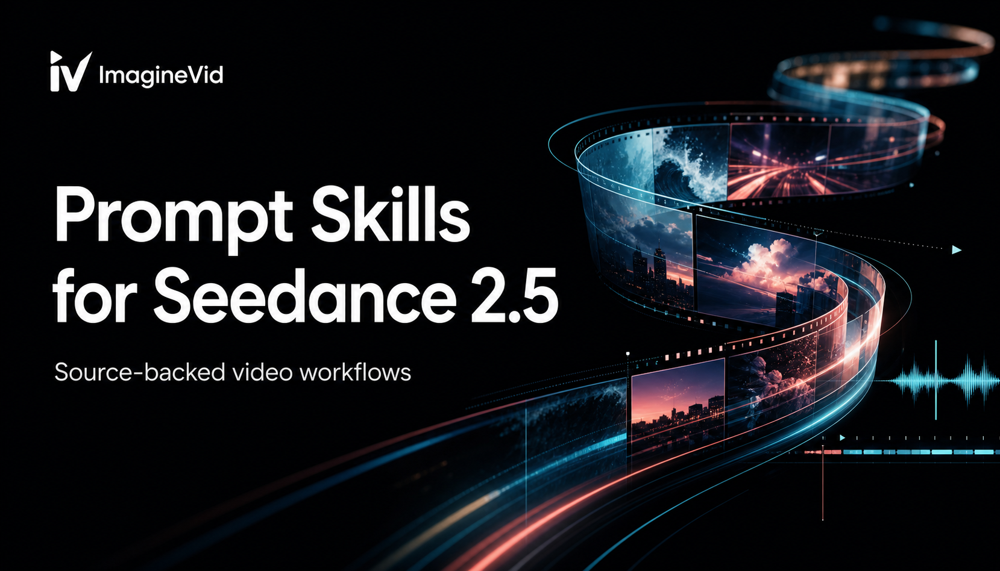

<a href="https://github.com/imagineVid/Awesome-seedance-2-5-prompts-and-skills">
  
</a>

> Seedance 2.5 için kaynakları doğrulanabilir çekim brifleri, hareket kalıpları ve görsel-işitsel iş akışları kütüphanesi.
# Awesome Seedance 2.5 Promtları ve Becerileri

[](https://github.com/sindresorhus/awesome)
[](https://github.com/imagineVid/Awesome-seedance-2-5-prompts-and-skills)
[](https://creativecommons.org/licenses/by/4.0/)
[](https://github.com/imagineVid/Awesome-seedance-2-5-prompts-and-skills/actions)
[](docs/CONTRIBUTING.md)

> Brifi inceleyin, sonucu izleyin, üreticiyi takip edin ve yüzeysel stili kopyalamak yerine yönetmenlik mantığını yeniden kullanın.

> **Atıf ve düzeltmeler:** Yayımlanan her örnek üreticisine ve kanonik kaynağa bağlantı verir. Haklar sahiplerinde kalır. Atıf değişikliği veya kaldırma için issue açın.

---

[](README.md) [](README.es.md) [](README.pt.md) [](README.it.md) [](README.de.md) [](README.fr.md) [](README.ar.md) [](README.ja.md) [](README.ko.md) [](README.zh.md)
[](README.nl.md) [](README.ru.md) [](README.tr.md) [](README.pl.md)

---

## Seedance 2.5 ile üret

**[ImagineVid üzerinde Seedance 2.5 iş akışını aç](https://imaginevid.io/seedance-2-0)**

Bu depo lansman heyecanı yerine doğrulanabilir kanıtlar üzerine kuruludur. Seedance 2.5 için özel bir rota açılana kadar bağlantılı ImagineVid sayfası mevcut Seedance 2.0 iş akışını açar.

Lansman iddiası model kanıtı değildir. Bir vaka ancak kaynağı Seedance 2.5'i açıkça tanımlıyor ve yeniden üretilebilir bir yöntemi öğretecek kadar prompt ile video sunuyorsa eklenir.

| Üretim ihtiyacı | Kanıt kütüphanesi | ImagineVid iş akışı |
|---------|--------------|---------------------|
| Örnek inceleme | Prompt, sonuç ve kaynak | Üret ve karşılaştır |
| Keşif | Depo metin araması | İş akışı odaklı keşif |
| Üretim | - | Seedance 2.5'ı aç |
| Okuma | GitHub uyumlu Markdown | Tarayıcı üretim çalışma alanı |
| Video iş akışları | - | Üretim filtreleri |


### Üretim iş akışına göre göz at

- [**Çok modlu referans yönetimi**](#workflow-multimodal-reference-direction) - Her referansa bir görev verin - Hangi girdinin kimliği, kompozisyonu, hareketi, sesi veya görsel işlemi yönettiğini belirtin
- [**Uzun çekim bloklama ve kamera yolları**](#workflow-long-take-blocking-camera-paths) - Kadraj, kamera yolu, blocking, tempo, açığa çıkarmalar ve geçişler etrafında kurulan çekim brifleri.
- [**Diyalog, Foley ve müzik zamanlaması**](#workflow-dialogue-foley-music-timing) - Konuşma, oyunculuk, ambiyans, müzik veya senkron sesin sahneyi taşıdığı performans odaklı promptlar.
- [**Anlatı sürekliliği ve karakter performansı**](#workflow-narrative-continuity-character-performance) - Sürekliliği kısıt olarak yazın - Kimliği, kostümü, ürün geometrisini, mekânı ve ışığı koruyun
- [**Ürün, moda ve kampanya hareketi**](#workflow-product-fashion-campaign-motion) - Ürünü, teklifi, giysiyi, yemeği, cihazı veya marka anını hareketin merkezinde tutan ticari klipler.
- [**Video düzenleme, uzatma ve yeniden stillendirme**](#workflow-video-editing-extension-restyling) - Sürekliliği koruyarak mevcut videoyu yeniden stillendiren, uzatan, ekleyen, kaldıran, değiştiren veya sahnenin bir kısmını yönlendiren iş akışları.

---

## İçindekiler

- [Seedance 2.5 ile üret](#seedance-25-ile-üret)
- [Seedance 2.5 nedir?](#seedance-25-nedir)
- [Koleksiyon durumu](#koleksiyon-durumu)
- [Öne çıkan video promptları](#community-featured-prompts)
- [Topluluk video promptları](#community-prompt-cases)
- [Doğrulanmış örnek gönder](#doğrulanmış-örnek-gönder)
- [Lisans](#lisans)
- [Üretici kredileri](#üretici-kredileri)
- [Depo büyümesi](#depo-büyümesi)

---

## Seedance 2.5 nedir?

**Seedance 2.5**, Temmuz 2026 tarihli haberlerde açıklanan yeni nesil Seedance video modeli için kullanılan addır. ByteDance'in herkese açık Seed model kataloğu henüz tam bir Seedance 2.5 model kartı, kararlı API kimliği veya ayrıntılı açık teknik özellik sunmuyor. Bu nedenle depo, doğrulanmış birincil materyali topluluk iddialarından ayırır ve ByteDance kalıcı belgeler yayımladığında kapsamını günceller.

Prompt kitaplığı, gerçek bir sonuçta incelenebilen unsurlara odaklanır: referansların rolü, görünür eylem, kamera yolu, ritim, diyalog ve ses ipuçları, süreklilik kısıtları ve kurgu niyeti. Sayısal yetenek iddiaları kararlı birincil kaynağa bağlanana kadar koleksiyona alınmaz.

- **Her referansa bir görev verin** - Hangi girdinin kimliği, kompozisyonu, hareketi, sesi veya görsel işlemi yönettiğini belirtin
- **Görünür neden ve sonucu açıklayın** - Her eylemi izleyicinin göreceği hareket, tepki veya çevresel değişimle ilişkilendirin
- **Sahneyi vuruşlara bölün** - Hikâyeyi özetlemek yerine gözlemlenebilir anları sıraya koyun
- **Ses parçasını yönetin** - Diyalog, Foley, ambiyans ve müziği yalnızca sahneyi ilerlettiği yerde belirtin
- **Kamera yolunu tanımlayın** - Kadrajı, hareketi, konu mesafesini ve önemli çekimler arasındaki geçişi belirleyin
- **Sürekliliği kısıt olarak yazın** - Kimliği, kostümü, ürün geometrisini, mekânı ve ışığı koruyun

**Güncel referanslar:** [Seedance 2.5 release reporting](https://www.theinformation.com/briefings/bytedance-unveils-seedance-2-5-video-model) · [ByteDance Seed model catalog](https://seed.bytedance.com/en/models) · [Available Seedance workflow on ImagineVid](https://imaginevid.io/seedance-2-0)

### Promptu çekim şablonuna dönüştür

Yeniden kullanılabilir video promptları sahne değişkenlerini yönetmenlik mantığından ayırır. Konuyu, ortamı, söylenen cümleyi veya ürünü değiştirirken denenmiş kamera yolunu, vuruş yapısını, ses planını ve süreklilik kurallarını koruyun.

**Şablon örüntüsü:**
```
[DURATION + ASPECT RATIO]. [SUBJECT] performs [VISIBLE ACTION] in [SETTING]. Camera: [FRAMING + MOVE]. Beats: [TIMED ACTIONS]. Audio: [DIALOGUE + FOLEY + AMBIENCE]. Preserve: [IDENTITY / PRODUCT / LAYOUT]. Avoid: [FAILURE MODES].
```

Bir eylem ve bir kamera fikriyle başlayın. Zamanlama, ses ve koruma kısıtlarını yalnızca görünür bir üretim ihtiyacını çözdüklerinde ekleyin; sonra üretimler arasında tek seferde bir değişkeni değiştirin.

---

## Koleksiyon durumu

<div align="center">

| Koleksiyon alanı | Güncel değer |
|--------|-------|
| Doğrulanmış örnekler | **12** |
| Editör seçimi | **2** |
| Oluşturulma | **21 Ağustos 2026 Cuma 04:42:26 UTC** |

</div>

---

<a id="community-featured-prompts"></a>

## Öne çıkan video promptları

> Yeniden üretilebilirlik, hareket açıklığı ve üretim faydasına göre seçildi

<a id="prompt-1"></a>

### #1: Sakin sokaklarda altın saat bisiklet yolculuğu


#### İş akışı neden önemli

Doğal ışıklı gündelik bir mahallede tek bisikletçiyi ve yumuşak takip hareketini anlaşılır tutan kısa bir çekim brifi.

#### Yerelleştirilmiş prompt

```
Yerelleştirilmiş sürüm: İngilizce kaynak prompttaki kamera, zamanlama, özne sürekliliği ve kısıtları koru; yalnızca görünen metni veya diyaloğu bu dile uyarla.

A young East Asian woman riding a bicycle through quiet city streets, casually exploring the neighborhood, cinematic, natural daylight, realistic, smooth camera movement.
```

<details>
<summary>Özgün kaynak prompt</summary>

```
A young East Asian woman riding a bicycle through quiet city streets, casually exploring the neighborhood, cinematic, natural daylight, realistic, smooth camera movement.
```

</details>

#### Video

<div align="center">
<a href="https://video.twimg.com/ext_tw_video/2074956835250122752/pu/vid/avc1/1280x720/GGVJY84yqzPpP7dZ.mp4?tag=26"></a>

*Videoyu açmak için önizlemeye tıklayın* · **[▶ Videoyu izle →](https://video.twimg.com/ext_tw_video/2074956835250122752/pu/vid/avc1/1280x720/GGVJY84yqzPpP7dZ.mp4?tag=26)**
</div>

#### Kanıt

- **Üretici:** [@noorwithwifi](https://x.com/noorwithwifi)
- **Kanonik kaynak:** [Kanonik kaynak](https://x.com/noorwithwifi/status/2074956913075491029)
- **Yayımlandı:** 8 Temmuz 2026
- **Prompt dili:** en

**[Bu yönlendirmeyle oluştur · ImagineVid](https://imaginevid.io/seedance-2-0)**

---

<a id="prompt-3"></a>

### #2: İki referanslı ve zaman kodlu endüstriyel dövüş


#### İş akışı neden önemli

İki dövüşçüyü, bloklamayı, kamera değişimlerini, ağır çekimi, darbeleri ve çevre tepkilerini on dört saniyede koordine eden yoğun bir aksiyon brifi.

#### Yerelleştirilmiş prompt

```
Yerelleştirilmiş sürüm: İngilizce kaynak prompttaki kamera, zamanlama, özne sürekliliği ve kısıtları koru; yalnızca görünen metni veya diyaloğu bu dile uyarla.

Aesthetic Tone: A stark industrial wasteland style featuring low-saturation cool grays and steel-blue hues, contrasted with the heavy, rugged textures of industrial machinery. Lighting & Shadow: Intense overhead lighting (mimicking a cage fight) casts sharp, deep shadows across the concrete floor and the characters' faces, emphasizing a sense of raw power.

[Timeline: Detailed Action & Camera Instructions]

00:00-00:01 | Pre-fight Standoff
[Combat Action]: @ Image1 and @ Image2 assume low-center-of-gravity fighting stances; their muscles are taut and tense.
[Camera Technique]: A horizontal pan (medium shot) sweeps from right to left across both characters, establishing the space of confrontation.
[Visual Effects]: Semi-transparent "GAME START" text floats in mid-air, featuring a metallic sheen and worn, distressed edges.

00:01-00:03 | Flying Kick & Cross-Arm Block
[Combat Action]: @ Image1 rapidly launches a fierce high side-kick at a 45-degree upward angle. @ Image2 instantly slides sideways, crossing arms into a shield-like "X" formation to block the incoming kick with solid, bone-jarring force.
[Camera Technique]: A whip zoom locks onto the point of impact, transitioning to slow motion (quarter speed) at the exact moment the leg and arms collide.
[Visual Effects]: The point of impact triggers a visible air-distortion ripple, accompanied by a scattering of sparks and dust particles generated by the friction.

00:03-00:06 | Close-Quarters Blitz & Facial Impact
[Combat Action]: After absorbing the blow, @ Image2 immediately counters with a rapid-fire "one-inch punch" combo, striking from both left and right. @ Image1 dodges hastily. @ Image2 follows through with a powerful right hook, fueled by hip rotation, that slams into @ Image1's left cheek, causing facial distortion and sending a spray of saliva and blood droplets flying.
[Camera Technique]: Handheld camera work sways with the body, creating a documentary-style shaky-cam aesthetic; micro-second screen shake marks the moment of a heavy punch impact.
[Visual Effects]: High-frequency "impact frames" (staccato light and shadow flashes) occur the instant the face is struck; sweat appears as glowing particles under side lighting.

00:06-00:10 | Pursuit and Liver-Targeting Knee Strike
[Action]: @ Image2 denies the opponent a chance to recover, stepping in to close the distance; the right hand hooks the back of @ Image1's neck and pulls downward while the right knee drives violently upward, delivering a knee strike to the liver. @ Image1 retches, body arching and curling in pain.
[Camera Technique]: Extreme low-angle shot looking upward to emphasize the power and impact of the knee strike.
[Visual Effects]: Realistic fabric indentation and intense creasing appear the moment the knee makes contact.

00:10-00:12 | Head-Clinch Slam
[Action]: @ Image2 locks both hands around @ Image1's head, twists the torso with leg-driven power, and executes a 180-degree arc throw, slamming @ Image1's head and upper body against the concrete ground.
[Camera Technique]: Rapid tilt down; the camera tracks the trajectory of the falling figure.
[Visual Effects]: On impact, localized cracks appear on the ground and a dense cloud of dust and grit explodes outward.

00:12-00:14 | Final Struggle
[Action]: @ Image1 lies in the dust, curled in pain; the right hand weakly clutches the abdomen, the chest heaves with labored breathing, and the eyes lose focus.
[Camera Technique]: Slow overhead close-up; the camera rotates slightly and pulls back with a crane move.
[Visual Effects]: Realistic airborne dust particles float in front of the lens, with subtle film grain across the image.
```

<details>
<summary>Özgün kaynak prompt</summary>

```
Aesthetic Tone: A stark industrial wasteland style featuring low-saturation cool grays and steel-blue hues, contrasted with the heavy, rugged textures of industrial machinery. Lighting & Shadow: Intense overhead lighting (mimicking a cage fight) casts sharp, deep shadows across the concrete floor and the characters' faces, emphasizing a sense of raw power.

[Timeline: Detailed Action & Camera Instructions]

00:00-00:01 | Pre-fight Standoff
[Combat Action]: @ Image1 and @ Image2 assume low-center-of-gravity fighting stances; their muscles are taut and tense.
[Camera Technique]: A horizontal pan (medium shot) sweeps from right to left across both characters, establishing the space of confrontation.
[Visual Effects]: Semi-transparent "GAME START" text floats in mid-air, featuring a metallic sheen and worn, distressed edges.

00:01-00:03 | Flying Kick & Cross-Arm Block
[Combat Action]: @ Image1 rapidly launches a fierce high side-kick at a 45-degree upward angle. @ Image2 instantly slides sideways, crossing arms into a shield-like "X" formation to block the incoming kick with solid, bone-jarring force.
[Camera Technique]: A whip zoom locks onto the point of impact, transitioning to slow motion (quarter speed) at the exact moment the leg and arms collide.
[Visual Effects]: The point of impact triggers a visible air-distortion ripple, accompanied by a scattering of sparks and dust particles generated by the friction.

00:03-00:06 | Close-Quarters Blitz & Facial Impact
[Combat Action]: After absorbing the blow, @ Image2 immediately counters with a rapid-fire "one-inch punch" combo, striking from both left and right. @ Image1 dodges hastily. @ Image2 follows through with a powerful right hook, fueled by hip rotation, that slams into @ Image1's left cheek, causing facial distortion and sending a spray of saliva and blood droplets flying.
[Camera Technique]: Handheld camera work sways with the body, creating a documentary-style shaky-cam aesthetic; micro-second screen shake marks the moment of a heavy punch impact.
[Visual Effects]: High-frequency "impact frames" (staccato light and shadow flashes) occur the instant the face is struck; sweat appears as glowing particles under side lighting.

00:06-00:10 | Pursuit and Liver-Targeting Knee Strike
[Action]: @ Image2 denies the opponent a chance to recover, stepping in to close the distance; the right hand hooks the back of @ Image1's neck and pulls downward while the right knee drives violently upward, delivering a knee strike to the liver. @ Image1 retches, body arching and curling in pain.
[Camera Technique]: Extreme low-angle shot looking upward to emphasize the power and impact of the knee strike.
[Visual Effects]: Realistic fabric indentation and intense creasing appear the moment the knee makes contact.

00:10-00:12 | Head-Clinch Slam
[Action]: @ Image2 locks both hands around @ Image1's head, twists the torso with leg-driven power, and executes a 180-degree arc throw, slamming @ Image1's head and upper body against the concrete ground.
[Camera Technique]: Rapid tilt down; the camera tracks the trajectory of the falling figure.
[Visual Effects]: On impact, localized cracks appear on the ground and a dense cloud of dust and grit explodes outward.

00:12-00:14 | Final Struggle
[Action]: @ Image1 lies in the dust, curled in pain; the right hand weakly clutches the abdomen, the chest heaves with labored breathing, and the eyes lose focus.
[Camera Technique]: Slow overhead close-up; the camera rotates slightly and pulls back with a crane move.
[Visual Effects]: Realistic airborne dust particles float in front of the lens, with subtle film grain across the image.
```

</details>

#### Video

<div align="center">
<a href="https://video.twimg.com/amplify_video/2077336525373923328/vid/avc1/1920x1080/wlKvDYYr__Dylt21.mp4?tag=28"></a>

*Videoyu açmak için önizlemeye tıklayın* · **[▶ Videoyu izle →](https://video.twimg.com/amplify_video/2077336525373923328/vid/avc1/1920x1080/wlKvDYYr__Dylt21.mp4?tag=28)**
</div>

#### Kanıt

- **Üretici:** [@AIReelofficial](https://x.com/AIReelofficial)
- **Kanonik kaynak:** [Kanonik kaynak](https://x.com/AIReelofficial/status/2077729460644872389)
- **Yayımlandı:** 16 Temmuz 2026
- **Prompt dili:** en

**[Bu yönlendirmeyle oluştur · ImagineVid](https://imaginevid.io/seedance-2-0)**

---

<a id="community-prompt-cases"></a>

## Topluluk video promptları

> Kaynak tarihi ve editoryal değere göre sıralanır.

<a id="workflow-multimodal-reference-direction"></a>

### Çok modlu referans yönetimi (2)

Her referansa bir görev verin - Hangi girdinin kimliği, kompozisyonu, hareketi, sesi veya görsel işlemi yönettiğini belirtin

**Öne çıkan video promptları**

- [İki referanslı ve zaman kodlu endüstriyel dövüş](#prompt-3)

<a id="prompt-7"></a>

#### #1: Yeni örnek: A seamless sequence on a vast frozen mountain peak


##### İş akışı neden önemli

X üzerindeki açık bir kaynağa dayanan, net görsel yönlendirme ve doğrulanabilir üretim kısıtları içeren yeniden kullanılabilir prompt.

##### Yerelleştirilmiş prompt

```
Yerelleştirilmiş sürüm: İngilizce kaynak prompttaki kamera, zamanlama, özne sürekliliği ve kısıtları koru; yalnızca görünen metni veya diyaloğu bu dile uyarla.

A seamless cinematic sequence on a vast frozen mountain peak during blue hour beneath a violent arctic blizzard. Endless snow-covered cliffs, towering glaciers, ancient stone ruins, and a colossal weathered throne carved into the mountain overlook an endless frozen kingdom. Thick snow falls through the air while powerful winds carry swirling ice particles across the landscape. The atmosphere feels ancient, sacred, and forgotten. Kael, a fearless legendary warrior with shoulder-length wavy black hair, sharp amber eyes, a rugged face with a subtle scar above his left eyebrow, walks slowly and confidently through the deep snow toward the ancient throne. He wears weathered black dragon-scale armor with intricate silver engravings, heavy armored boots, leather belts across his chest, and a long tattered black cloak flowing naturally in the wind. A massive glowing blue runic greatsword rests on his back, casting a soft blue light onto the snow. The camera begins with an ultra-wide aerial shot before descending into one smooth forward tracking shot behind Kael. Every footstep leaves deep impressions in the snow. His cloak and hair react naturally to the storm while distant thunder echoes through the mountains. Kael reaches the ancient throne and slowly unsheathes his glowing blue runic greatsword. Without hesitation, he drives the sword into the frozen ground before the throne. The instant the blade touches the ice, brilliant blue energy surges outward in glowing cracks racing across the mountain. The storm suddenly becomes silent. Thousands of ancient spectral warriors begin rising from beneath the snow across the mountain. Their translucent blue armor glows softly as they emerge in complete silence. One after another, they kneel toward Kael, forming an endless ghostly army stretching across the frozen landscape. The camera slowly pulls back and rises high above the mountain, revealing Kael standing alone before the throne with his glowing sword planted in the ice while an enormous spectral army kneels beneath him. Snow continues falling peacefully as blue light illuminates the entire mountain. The sequence ends with a breathtaking ultra-wide aerial view before fading to black. Ultra-photorealistic fantasy filmmaking, Hollywood blockbuster, IMAX scale, cinematic blue-hour lighting, volumetric snowfall, realistic cloth and hair simulation, physically accurate anim.
```

<details>
<summary>Özgün kaynak prompt</summary>

```
A seamless cinematic sequence on a vast frozen mountain peak during blue hour beneath a violent arctic blizzard. Endless snow-covered cliffs, towering glaciers, ancient stone ruins, and a colossal weathered throne carved into the mountain overlook an endless frozen kingdom. Thick snow falls through the air while powerful winds carry swirling ice particles across the landscape. The atmosphere feels ancient, sacred, and forgotten. Kael, a fearless legendary warrior with shoulder-length wavy black hair, sharp amber eyes, a rugged face with a subtle scar above his left eyebrow, walks slowly and confidently through the deep snow toward the ancient throne. He wears weathered black dragon-scale armor with intricate silver engravings, heavy armored boots, leather belts across his chest, and a long tattered black cloak flowing naturally in the wind. A massive glowing blue runic greatsword rests on his back, casting a soft blue light onto the snow. The camera begins with an ultra-wide aerial shot before descending into one smooth forward tracking shot behind Kael. Every footstep leaves deep impressions in the snow. His cloak and hair react naturally to the storm while distant thunder echoes through the mountains. Kael reaches the ancient throne and slowly unsheathes his glowing blue runic greatsword. Without hesitation, he drives the sword into the frozen ground before the throne. The instant the blade touches the ice, brilliant blue energy surges outward in glowing cracks racing across the mountain. The storm suddenly becomes silent. Thousands of ancient spectral warriors begin rising from beneath the snow across the mountain. Their translucent blue armor glows softly as they emerge in complete silence. One after another, they kneel toward Kael, forming an endless ghostly army stretching across the frozen landscape. The camera slowly pulls back and rises high above the mountain, revealing Kael standing alone before the throne with his glowing sword planted in the ice while an enormous spectral army kneels beneath him. Snow continues falling peacefully as blue light illuminates the entire mountain. The sequence ends with a breathtaking ultra-wide aerial view before fading to black. Ultra-photorealistic fantasy filmmaking, Hollywood blockbuster, IMAX scale, cinematic blue-hour lighting, volumetric snowfall, realistic cloth and hair simulation, physically accurate anim.
```

</details>

##### Video

<div align="center">
<a href="https://video.twimg.com/amplify_video/2081585276347121664/vid/avc1/1920x1080/mTsw-MR6gwrWSBUY.mp4?tag=29"></a>

*Videoyu açmak için önizlemeye tıklayın* · **[▶ Videoyu izle →](https://video.twimg.com/amplify_video/2081585276347121664/vid/avc1/1920x1080/mTsw-MR6gwrWSBUY.mp4?tag=29)**
</div>

##### Kanıt

- **Üretici:** [Zephyra Leigh](https://x.com/ZephyraLeigh)
- **Kanonik kaynak:** [Kanonik kaynak](https://x.com/ZephyraLeigh/status/2081585413475766574)
- **Yayımlandı:** 27 Temmuz 2026
- **Prompt dili:** en

**[Bu yönlendirmeyle oluştur · ImagineVid](https://imaginevid.io/seedance-2-0)**

---

<a id="workflow-long-take-blocking-camera-paths"></a>

### Uzun çekim bloklama ve kamera yolları (5)

Kadraj, kamera yolu, blocking, tempo, açığa çıkarmalar ve geçişler etrafında kurulan çekim brifleri.

<a id="prompt-2"></a>

#### #2: Siberpunk hacker robotla otuz saniyelik tek çekim


##### İş akışı neden önemli

Tek bir özne, çalışma alanı ve kesintisiz eylemin uzun çekime nasıl yayıldığını incelemek için bilinçli olarak kısa tutulmuş bir prompt.

##### Yerelleştirilmiş prompt

```
Yerelleştirilmiş sürüm: İngilizce kaynak prompttaki kamera, zamanlama, özne sürekliliği ve kısıtları koru; yalnızca görünen metni veya diyaloğu bu dile uyarla.

Cyberpunk hacker robot working in front of many monitors.
```

<details>
<summary>Özgün kaynak prompt</summary>

```
Cyberpunk hacker robot working in front of many monitors.
```

</details>

##### Video

<div align="center">
<a href="https://video.twimg.com/ext_tw_video/2077113718106648577/pu/vid/avc1/1280x720/twNk6uhZZRnoFngO.mp4?tag=12"></a>

*Videoyu açmak için önizlemeye tıklayın* · **[▶ Videoyu izle →](https://video.twimg.com/ext_tw_video/2077113718106648577/pu/vid/avc1/1280x720/twNk6uhZZRnoFngO.mp4?tag=12)**
</div>

##### Kanıt

- **Üretici:** [@thedoomguy_ai](https://x.com/thedoomguy_ai)
- **Kanonik kaynak:** [Kanonik kaynak](https://x.com/thedoomguy_ai/status/2077113772959740310)
- **Yayımlandı:** 14 Temmuz 2026
- **Prompt dili:** en

**[Bu yönlendirmeyle oluştur · ImagineVid](https://imaginevid.io/seedance-2-0)**

---

<a id="prompt-5"></a>

#### #3: Tek kesintisiz planda dört mevsim


##### İş akışı neden önemli

Otuz saniyelik çevre sürekliliğini sınamak için halka açık demodan editoryal olarak yeniden kurulan istem.

##### Yerelleştirilmiş prompt

```
Aynı manzara boyunca kesintisiz 30 saniyelik bir kamera hareketi oluştur; ilkbahar yaza, yaz sonbahara, sonbahar kışa dönüşsün. Kamera yolu, işaret noktaları ve hız aynen kalsın; bitki örtüsü, hava, ışık, zemin, ses ve insan etkinliği doğal biçimde değişsin. Geçişleri ön plan örtüsü, parçacıklar veya gerekçeli dönüşlerle gizle. Kesme, geometri sıçraması ve kimlik değişimi olmasın. Başlangıçtaki aynı kompozisyon ekseninde bitir.
```

<details>
<summary>Özgün kaynak prompt</summary>

```
Create one uninterrupted 30-second camera move through the same landscape as spring transforms into summer, summer into autumn, and autumn into winter. Preserve the exact path, landmark positions, and camera speed while vegetation, weather, daylight, ground texture, ambient sound, and human activity evolve naturally with each season. Hide every transition inside foreground occlusion, drifting particles, or a motivated camera turn. No cuts, no geometry jumps, and no sudden identity changes. End from the same compositional axis established at the beginning.
```

</details>

##### Video

<div align="center">
<a href="https://video.twimg.com/amplify_video/2071689424891527168/vid/avc1/1920x1080/aPpOZyVnA973XFrL.mp4?tag=28"></a>

*Videoyu açmak için önizlemeye tıklayın* · **[▶ Videoyu izle →](https://video.twimg.com/amplify_video/2071689424891527168/vid/avc1/1920x1080/aPpOZyVnA973XFrL.mp4?tag=28)**
</div>

##### Kanıt

- **Üretici:** [@JSFILMZ0412](https://x.com/JSFILMZ0412)
- **Kanonik kaynak:** [Kanonik kaynak](https://x.com/JSFILMZ0412/status/2071692606573277428)
- **Yayımlandı:** 29 Haziran 2026
- **Prompt dili:** en

**[Bu yönlendirmeyle oluştur · ImagineVid](https://imaginevid.io/seedance-2-0)**

---

<a id="prompt-6"></a>

#### #4: Kamera hareket ederken havada donan leopar


##### İş akışı neden önemli

Dramatik bir vahşi yaşam yörüngesi için özne zamanını kamera zamanından ayıran herkese açık Seedance 2.5 sonucunun yeniden kurulumu.

##### Yerelleştirilmiş prompt

```
Yerelleştirilmiş sürüm: İngilizce kaynak prompttaki kamera, zamanlama, özne sürekliliği ve kısıtları koru; yalnızca görünen metni veya diyaloğu bu dile uyarla.

Create a 10-second vertical wildlife-commercial shot in a sunlit savanna. A leopard launches across a narrow rocky gap. At the apex of the jump, freeze the leopard completely in time while dust, grass, and the surrounding environment continue moving naturally. The camera does not stop: sweep from a low side-tracking angle into a smooth 180-degree orbit around the suspended animal, revealing detailed fur, focused eyes, stretched anatomy, and the valley beyond. After the orbit, release time and let the leopard land with believable weight as dust rolls past the lens. Maintain one leopard, coherent terrain, correct limb anatomy, natural parallax, warm late-afternoon light, and continuous ambient wind and impact audio. No cuts, no duplicated animal, no frozen background, no text.
```

<details>
<summary>Özgün kaynak prompt</summary>

```
Create a 10-second vertical wildlife-commercial shot in a sunlit savanna. A leopard launches across a narrow rocky gap. At the apex of the jump, freeze the leopard completely in time while dust, grass, and the surrounding environment continue moving naturally. The camera does not stop: sweep from a low side-tracking angle into a smooth 180-degree orbit around the suspended animal, revealing detailed fur, focused eyes, stretched anatomy, and the valley beyond. After the orbit, release time and let the leopard land with believable weight as dust rolls past the lens. Maintain one leopard, coherent terrain, correct limb anatomy, natural parallax, warm late-afternoon light, and continuous ambient wind and impact audio. No cuts, no duplicated animal, no frozen background, no text.
```

</details>

##### Video

<div align="center">
<a href="https://video.twimg.com/ext_tw_video/2079745224570519552/pu/vid/avc1/720x1280/27yst_h2-L4NaPMA.mp4?tag=12"></a>

*Videoyu açmak için önizlemeye tıklayın* · **[▶ Videoyu izle →](https://video.twimg.com/ext_tw_video/2079745224570519552/pu/vid/avc1/720x1280/27yst_h2-L4NaPMA.mp4?tag=12)**
</div>

##### Kanıt

- **Üretici:** [jzcreates](https://x.com/jzcreates)
- **Kanonik kaynak:** [Kanonik kaynak](https://x.com/jzcreates/status/2079745245713928390)
- **Yayımlandı:** 22 Temmuz 2026
- **Prompt dili:** en

**[Bu yönlendirmeyle oluştur · ImagineVid](https://imaginevid.io/seedance-2-0)**

---

<a id="prompt-8"></a>

#### #5: Yeni örnek: Early morning; sunlight filters through the forest canopy, casting


##### İş akışı neden önemli

X üzerindeki açık bir kaynağa dayanan, net görsel yönlendirme ve doğrulanabilir üretim kısıtları içeren yeniden kullanılabilir prompt.

##### Yerelleştirilmiş prompt

```
Yerelleştirilmiş sürüm: İngilizce kaynak prompttaki kamera, zamanlama, özne sürekliliği ve kısıtları koru; yalnızca görünen metni veya diyaloğu bu dile uyarla.

Early morning; sunlight filters through the forest canopy, casting a glow over the bank of a clear stream. The scene opens with a gentle, cinematic perspective. No faces are shown—only a pair of warm, capable hands. Shot 1: Hands carry a bamboo basket to the edge of the crystal-clear stream, where the water flows gently and small fish dart about. A hand uses a bamboo net to catch a fresh, silvery fish; it flops lightly in the basket, sending droplets of water splashing and sparkling in the sunlight. The atmosphere is natural, calm, and soothing. Shot 2: Moving to a wooden table by the stream, the hands begin preparing the ingredients. The fresh fish is placed on a wooden cutting board and slowly sliced ​​with a sharp knife, revealing the clear texture of the flesh through clean, fluid movements. Next, a block of tender white tofu is gently cut into neat, uniform cubes; the surface of the tofu appears soft and smooth. Shot 3: Tofu and fish soup is prepared in a traditional earthenware pot over a small stove at the edge of the forest. As the water begins to boil, fish slices, tofu, chopped scallions, and fresh vegetables are added. Steam rises gently, the broth turns a milky white, and the fish and tofu tumble softly within the simmering liquid. Shot 4: Finally, the camera closes in on a bowl of the freshly cooked soup. White steam drifts upward, and sunlight catches the surface of the broth; a simple wooden spoon and the bamboo basket sit nearby. The backdrop features the forest, the stream, and leaves swaying in the breeze, evoking a sense of returning to nature and finding peaceful happiness. Style Requirements: Warm, hand-drawn style reminiscent of Hayao Miyazaki’s animated films; delicate watercolor textures; soft, natural lighting; rich forest greens; a soothing, tranquil, and heartwarming atmosphere; a blend of high-quality 2D animation and 3D spatial depth; cinematic camera work; fluid, natural movement; realistic physical interactions; rich detail in the ingredients; 4K cinematic animation quality. Sound Design (Crucial): Use only natural ambient sounds—no background music, no dialogue. Sounds include: the clear sound of the flowing stream; birdsong; leaves rustling in the breeze; dripping water; the soft sounds of the knife slicing fish and tofu; the crackling of burning firewood; the bubbling of the earthenware pot; the sound of the soup simmering..
```

<details>
<summary>Özgün kaynak prompt</summary>

```
Early morning; sunlight filters through the forest canopy, casting a glow over the bank of a clear stream. The scene opens with a gentle, cinematic perspective. No faces are shown—only a pair of warm, capable hands. Shot 1: Hands carry a bamboo basket to the edge of the crystal-clear stream, where the water flows gently and small fish dart about. A hand uses a bamboo net to catch a fresh, silvery fish; it flops lightly in the basket, sending droplets of water splashing and sparkling in the sunlight. The atmosphere is natural, calm, and soothing. Shot 2: Moving to a wooden table by the stream, the hands begin preparing the ingredients. The fresh fish is placed on a wooden cutting board and slowly sliced ​​with a sharp knife, revealing the clear texture of the flesh through clean, fluid movements. Next, a block of tender white tofu is gently cut into neat, uniform cubes; the surface of the tofu appears soft and smooth. Shot 3: Tofu and fish soup is prepared in a traditional earthenware pot over a small stove at the edge of the forest. As the water begins to boil, fish slices, tofu, chopped scallions, and fresh vegetables are added. Steam rises gently, the broth turns a milky white, and the fish and tofu tumble softly within the simmering liquid. Shot 4: Finally, the camera closes in on a bowl of the freshly cooked soup. White steam drifts upward, and sunlight catches the surface of the broth; a simple wooden spoon and the bamboo basket sit nearby. The backdrop features the forest, the stream, and leaves swaying in the breeze, evoking a sense of returning to nature and finding peaceful happiness. Style Requirements: Warm, hand-drawn style reminiscent of Hayao Miyazaki’s animated films; delicate watercolor textures; soft, natural lighting; rich forest greens; a soothing, tranquil, and heartwarming atmosphere; a blend of high-quality 2D animation and 3D spatial depth; cinematic camera work; fluid, natural movement; realistic physical interactions; rich detail in the ingredients; 4K cinematic animation quality. Sound Design (Crucial): Use only natural ambient sounds—no background music, no dialogue. Sounds include: the clear sound of the flowing stream; birdsong; leaves rustling in the breeze; dripping water; the soft sounds of the knife slicing fish and tofu; the crackling of burning firewood; the bubbling of the earthenware pot; the sound of the soup simmering..
```

</details>

##### Video

<div align="center">
<a href="https://video.twimg.com/amplify_video/2079123345271136256/vid/avc1/1920x1080/stv5h4mJLVg6P1i_.mp4?tag=29"></a>

*Videoyu açmak için önizlemeye tıklayın* · **[▶ Videoyu izle →](https://video.twimg.com/amplify_video/2079123345271136256/vid/avc1/1920x1080/stv5h4mJLVg6P1i_.mp4?tag=29)**
</div>

##### Kanıt

- **Üretici:** [AIReel](https://x.com/AIReelofficial)
- **Kanonik kaynak:** [Kanonik kaynak](https://x.com/AIReelofficial/status/2079531584869548309)
- **Yayımlandı:** 21 Temmuz 2026
- **Prompt dili:** en

**[Bu yönlendirmeyle oluştur · ImagineVid](https://imaginevid.io/seedance-2-0)**

---

<a id="prompt-9"></a>

#### #6: Kesintisiz bir kovalamacayla çığdan kaçış


##### İş akışı neden önemli

Açık zamanlamaya, havadan yere inen kamera koreografisine, fiziksel kar etkileşimine ve doğal ortam sesine sahip kaynaklı bir Seedance 2.5 uzun plan brifi.

##### Yerelleştirilmiş prompt

```
Yerelleştirilmiş sürüm: İngilizce kanonik promptun kamera, zamanlama, araç sürekliliği ve kısıtlarını koruyun; yalnızca görünen metni veya diyalogları uyarlayın.

Create a 15-second 16:9 photorealistic action film as one true continuous shot with no cuts, transitions, morphing, or time jumps. Keep the same rally car, driver, road geometry, snow, and lighting throughout.

0.0-2.5s: begin with a high aerial view of a narrow alpine cliff road, sharp switchbacks, distant snow peaks, and an avalanche starting above the route. 2.5-5.5s: descend physically toward the rally car and settle into a close side chase as the tires throw cold powder and the suspension reacts to the uneven ice. 5.5-8.5s: drop beside the spinning rear wheel, then rise over the roof to reveal the avalanche gaining ground behind the car. 8.5-11.5s: arc outward into a wide circling drone-like move and descend into a front-facing backward tracking shot as the car drifts around the last switchback. 11.5-15.0s: keep the camera moving with the car as it clears the tunnel entrance just before the slope collapses behind it; finish on a brief spray of snow and a stable hero frame.

Use cold daylight, realistic tire grip, suspension motion, airborne snow, rock contact, and consistent vehicle scale. Build native sound from engine load, tire chatter, wind, avalanche rumble, snow impact, tunnel reverb, and one restrained final music hit. Preserve believable geography and continuous motion. Avoid duplicate cars, changing road layouts, impossible camera teleportation, artificial camera shake, extra vehicles, logos, captions, watermarks, and cartoon or game-like rendering.
```

<details>
<summary>Özgün kaynak prompt</summary>

```
Create a 15-second 16:9 photorealistic action film as one true continuous shot with no cuts, transitions, morphing, or time jumps. Keep the same rally car, driver, road geometry, snow, and lighting throughout.

0.0-2.5s: begin with a high aerial view of a narrow alpine cliff road, sharp switchbacks, distant snow peaks, and an avalanche starting above the route. 2.5-5.5s: descend physically toward the rally car and settle into a close side chase as the tires throw cold powder and the suspension reacts to the uneven ice. 5.5-8.5s: drop beside the spinning rear wheel, then rise over the roof to reveal the avalanche gaining ground behind the car. 8.5-11.5s: arc outward into a wide circling drone-like move and descend into a front-facing backward tracking shot as the car drifts around the last switchback. 11.5-15.0s: keep the camera moving with the car as it clears the tunnel entrance just before the slope collapses behind it; finish on a brief spray of snow and a stable hero frame.

Use cold daylight, realistic tire grip, suspension motion, airborne snow, rock contact, and consistent vehicle scale. Build native sound from engine load, tire chatter, wind, avalanche rumble, snow impact, tunnel reverb, and one restrained final music hit. Preserve believable geography and continuous motion. Avoid duplicate cars, changing road layouts, impossible camera teleportation, artificial camera shake, extra vehicles, logos, captions, watermarks, and cartoon or game-like rendering.
```

</details>

##### Kaynak ve sonuç kareleri

<table>
<tr>
<td width="50%" valign="top" align="center"></td>
<td width="50%" valign="top" align="center"></td>
</tr>
</table>

##### Video

<div align="center">
<a href="https://video.twimg.com/amplify_video/2080358249719844864/vid/avc1/1280x720/1s22T4RgtkM-uRH-.mp4?tag=29"></a>

*Videoyu açmak için önizlemeye tıklayın* · **[▶ Videoyu izle →](https://video.twimg.com/amplify_video/2080358249719844864/vid/avc1/1280x720/1s22T4RgtkM-uRH-.mp4?tag=29)**
</div>

##### Kanıt

- **Üretici:** [Brent Lynch](https://x.com/BrentLynch)
- **Kanonik kaynak:** [Kanonik kaynak](https://x.com/BrentLynch/status/2080359232160120942)
- **Yayımlandı:** 23 Temmuz 2026
- **Prompt dili:** en

**[Bu yönlendirmeyle oluştur · ImagineVid](https://imaginevid.io/seedance-2-0)**

---

<a id="workflow-dialogue-foley-music-timing"></a>

### Diyalog, Foley ve müzik zamanlaması (2)

Konuşma, oyunculuk, ambiyans, müzik veya senkron sesin sahneyi taşıdığı performans odaklı promptlar.

<a id="prompt-4"></a>

#### #7: Uzaylı gelişini anlatan karanlık fragman


##### İş akışı neden önemli

Artan gizemi, küresel ölçeği ve tutarlı sinematik ritmi sınayan kısa otuz saniyelik istem.

##### Yerelleştirilmiş prompt

```
Uzaylıların Dünya'ya gelişini anlatan sinematik, karanlık ve gizemli bir film fragmanı.
```

<details>
<summary>Özgün kaynak prompt</summary>

```
A cinematic, dark and mysterious trailer for a movie about aliens arriving on Earth.
```

</details>

##### Video

<div align="center">
<a href="https://video.twimg.com/amplify_video/2075206120461709312/vid/avc1/1280x720/-Sd8GC06pfI6PfH2.mp4?tag=28"></a>

*Videoyu açmak için önizlemeye tıklayın* · **[▶ Videoyu izle →](https://video.twimg.com/amplify_video/2075206120461709312/vid/avc1/1280x720/-Sd8GC06pfI6PfH2.mp4?tag=28)**
</div>

##### Kanıt

- **Üretici:** [@synthwavedd](https://x.com/synthwavedd)
- **Kanonik kaynak:** [Kanonik kaynak](https://x.com/synthwavedd/status/2075206446879265049)
- **Yayımlandı:** 9 Temmuz 2026
- **Prompt dili:** en

**[Bu yönlendirmeyle oluştur · ImagineVid](https://imaginevid.io/seedance-2-0)**

---

<a id="prompt-12"></a>

#### #8: Dokunsal ASMR ritmiyle çiçek presleme vlogu


##### İş akışı neden önemli

Hazırlıktan dokunsal çiçek preslemeye, doğal diyaloğa, kitabın ağırlığına, kart düzenine ve kamera gerçekçiliğine ilerleyen kaynaklı Seedance 2.5 UGC brifi.

##### Yerelleştirilmiş prompt

```
Tutarlı sonuçlar için kanonik prompt İngilizce bırakılmıştır; bu not yerelleştirilmiş amacı özetler:

Create a 12-second vertical UGC-style video of an adult creator making a small flower press at a bright wooden desk. Use natural handheld smartphone framing, gentle focus breathing, and quiet room ambience. 0-3s: she places two delicate wildflowers on a cream card and says, “I’m pressing these before the color fades.” 3-6s: show a close-up of her fingertips aligning the stems, the paper fibers, and a small handwritten date card; keep the text limited to the date and make it cleanly readable. 6-9s: she closes a thick sketchbook over the flowers and presses down with both palms, emphasizing the soft paper creak and book weight. 9-12s: cut to a top-down reveal of the arranged card, dried leaves, and a small glass of water while she says, “Now we wait.” Preserve hand anatomy, flower identity, card placement, and natural daylight. Sync the dialogue, paper sounds, book movement, and tiny desk taps. Avoid jumpy edits, invented labels, distorted fingers, floating petals, logos, captions, or watermarks.
```

<details>
<summary>Özgün kaynak prompt</summary>

```
Create a 12-second vertical UGC-style video of an adult creator making a small flower press at a bright wooden desk. Use natural handheld smartphone framing, gentle focus breathing, and quiet room ambience. 0-3s: she places two delicate wildflowers on a cream card and says, “I’m pressing these before the color fades.” 3-6s: show a close-up of her fingertips aligning the stems, the paper fibers, and a small handwritten date card; keep the text limited to the date and make it cleanly readable. 6-9s: she closes a thick sketchbook over the flowers and presses down with both palms, emphasizing the soft paper creak and book weight. 9-12s: cut to a top-down reveal of the arranged card, dried leaves, and a small glass of water while she says, “Now we wait.” Preserve hand anatomy, flower identity, card placement, and natural daylight. Sync the dialogue, paper sounds, book movement, and tiny desk taps. Avoid jumpy edits, invented labels, distorted fingers, floating petals, logos, captions, or watermarks.
```

</details>

##### Video

<div align="center">
<a href="https://video.twimg.com/amplify_video/2084268630556983296/vid/avc1/1920x1080/kPWIx5WQsdO1yzGR.mp4?tag=29"></a>

*Videoyu açmak için önizlemeye tıklayın* · **[▶ Videoyu izle →](https://video.twimg.com/amplify_video/2084268630556983296/vid/avc1/1920x1080/kPWIx5WQsdO1yzGR.mp4?tag=29)**
</div>

##### Kanıt

- **Üretici:** [𝐌](https://x.com/Strength04_X)
- **Kanonik kaynak:** [Kanonik kaynak](https://x.com/Strength04_X/status/2084269139556761919)
- **Yayımlandı:** 3 Ağustos 2026
- **Prompt dili:** en

**[Bu yönlendirmeyle oluştur · ImagineVid](https://imaginevid.io/seedance-2-0)**

---

<a id="workflow-narrative-continuity-character-performance"></a>

### Anlatı sürekliliği ve karakter performansı (3)

Sürekliliği kısıt olarak yazın - Kimliği, kostümü, ürün geometrisini, mekânı ve ışığı koruyun

**Öne çıkan video promptları**

- [Sakin sokaklarda altın saat bisiklet yolculuğu](#prompt-1)

<a id="prompt-10"></a>

#### #9: Hawaii tropik seyahat günlüğü


##### İş akışı neden önemli

“Hawaii tropik seyahat günlüğü” konusunu yeniden kullanılabilir talimatlar ve doğrulanabilir sonuç medyasıyla ele alan kaynaklı bir vaka.

##### Yerelleştirilmiş prompt

```
Yerelleştirilmiş sürüm: görsel amacı, özne sürekliliğini ve kanonik İngilizce promptun tüm kısıtlarını koruyun.

A cinematic 30-second tropical travel vlog montage featuring a beautiful 20-year-old East Asian woman with dark hair exploring Hawaii during a dreamy summer vacation. Shot like an authentic luxury travel diary with handheld camera movement, candid moments, soft golden-hour sunlight, dreamy 35mm film aesthetics, warm vintage color grading, shallow depth of field, natural skin texture, atmospheric lighting, and cinematic storytelling. Maintain the same woman throughout every scene: dark hair, youthful appearance, natural makeup, elegant summer outfits, relaxed happy expression. Format: 4K cinematic video, 24fps, 35mm film grain, realistic handheld camera, soft focus, warm color palette, travel documentary style. Scene 1 (0-4s) — Arrival & City Walk: A beautiful Hawaiian morning. The woman walks through a bright tropical city street wearing a flowing floral summer dress and sunglasses. Palm trees line the sidewalk, sunlight reflects off colorful buildings, people walk casually in the background. Camera follows from behind, then transitions into a close-up of her smiling face as wind moves through her hair. Scene 2 (4-8s) — Beach Discovery: She steps onto a wide sandy beach with crystal blue ocean waves behind her. She walks barefoot along the shoreline, holding her dress slightly as waves touch her feet. Low-angle cinematic shots of footsteps in wet sand, ocean reflections, distant volcanic mountains under a clear sky. Scene 3 (8-12s) — Tropical Nature Moments: A cinematic worm's-eye view looking upward through towering palm trees. Golden sunlight streams between the leaves with beautiful lens flares. Cut to a close-up of her standing near a rocky ocean cliff, wind blowing through her hair while she looks peacefully toward the sea. Scene 4 (12-16s) — Beachfront Cafe & Slow Living: She sits alone at a cozy beachfront cafe near the window, drinking a tropical drink while watching waves outside. Soft sunlight enters through the glass. Close-up shots of her hands, coffee cup, ocean view, and thoughtful expression create an intimate travel diary feeling. Scene 5 (16-20s) — Ocean Adventure: She floats peacefully on a surfboard in calm turquoise ocean water. Camera moves around her from water level, showing gentle waves, sunlight sparkling on the sea surface, tropical coastline and mountains in the distance. She laughs naturally while looking toward the camera. Scene 6 (20-24s) — Night Market Exploration: A vibrant Hawaiian night market filled with warm lights, food stalls, and colorful decorations. She walks through the crowd, trying tropical fruit skewers and local street food. Cinematic close-ups of her reaction, glowing lanterns, neon bokeh, and bustling atmosphere. Scene 7 (24-27s) — Golden Sunset Ending: Wide cinematic silhouette shot of her standing on the ocean shore during sunset. Orange and pink skies reflect on the water. Waves gently move around her feet as she watches the sun disappear behind the horizon. Emotional travel film ending. Scene 8 (27-30s) — Hotel Night Reflection: Nighttime high-rise hotel balcony overlooking sparkling tropical city lights. She wears a simple white dress, leaning against the balcony while a warm breeze moves the curtains behind her. Final intimate close-up of her lying on the hotel bed, looking warmly into the camera lens with a peaceful smile. Camera Style: Authentic travel vlog cinematography, handheld camera shake, smooth cinematic transitions, slow push-ins, natural movement, occasional POV shots, realistic autofocus adjustments, subtle motion blur. Visual Style: Dreamy Hawaii vacation film, luxury travel advertisement aesthetic, soft golden sunlight, realistic skin texture, cinematic depth of field, nostalgic 35mm film look, warm atmospheric colors, natural expressions, emotional storytelling. Avoid: cartoon style, CGI look, plastic skin, unrealistic face, inconsistent character appearance, changing hairstyle, extra fingers, distorted body, artificial lighting, oversaturated colors, blurry face, unnatural movements, duplicate people.
```

<details>
<summary>Özgün kaynak prompt</summary>

```
A cinematic 30-second tropical travel vlog montage featuring a beautiful 20-year-old East Asian woman with dark hair exploring Hawaii during a dreamy summer vacation. Shot like an authentic luxury travel diary with handheld camera movement, candid moments, soft golden-hour sunlight, dreamy 35mm film aesthetics, warm vintage color grading, shallow depth of field, natural skin texture, atmospheric lighting, and cinematic storytelling. Maintain the same woman throughout every scene: dark hair, youthful appearance, natural makeup, elegant summer outfits, relaxed happy expression. Format: 4K cinematic video, 24fps, 35mm film grain, realistic handheld camera, soft focus, warm color palette, travel documentary style. Scene 1 (0-4s) — Arrival & City Walk: A beautiful Hawaiian morning. The woman walks through a bright tropical city street wearing a flowing floral summer dress and sunglasses. Palm trees line the sidewalk, sunlight reflects off colorful buildings, people walk casually in the background. Camera follows from behind, then transitions into a close-up of her smiling face as wind moves through her hair. Scene 2 (4-8s) — Beach Discovery: She steps onto a wide sandy beach with crystal blue ocean waves behind her. She walks barefoot along the shoreline, holding her dress slightly as waves touch her feet. Low-angle cinematic shots of footsteps in wet sand, ocean reflections, distant volcanic mountains under a clear sky. Scene 3 (8-12s) — Tropical Nature Moments: A cinematic worm's-eye view looking upward through towering palm trees. Golden sunlight streams between the leaves with beautiful lens flares. Cut to a close-up of her standing near a rocky ocean cliff, wind blowing through her hair while she looks peacefully toward the sea. Scene 4 (12-16s) — Beachfront Cafe & Slow Living: She sits alone at a cozy beachfront cafe near the window, drinking a tropical drink while watching waves outside. Soft sunlight enters through the glass. Close-up shots of her hands, coffee cup, ocean view, and thoughtful expression create an intimate travel diary feeling. Scene 5 (16-20s) — Ocean Adventure: She floats peacefully on a surfboard in calm turquoise ocean water. Camera moves around her from water level, showing gentle waves, sunlight sparkling on the sea surface, tropical coastline and mountains in the distance. She laughs naturally while looking toward the camera. Scene 6 (20-24s) — Night Market Exploration: A vibrant Hawaiian night market filled with warm lights, food stalls, and colorful decorations. She walks through the crowd, trying tropical fruit skewers and local street food. Cinematic close-ups of her reaction, glowing lanterns, neon bokeh, and bustling atmosphere. Scene 7 (24-27s) — Golden Sunset Ending: Wide cinematic silhouette shot of her standing on the ocean shore during sunset. Orange and pink skies reflect on the water. Waves gently move around her feet as she watches the sun disappear behind the horizon. Emotional travel film ending. Scene 8 (27-30s) — Hotel Night Reflection: Nighttime high-rise hotel balcony overlooking sparkling tropical city lights. She wears a simple white dress, leaning against the balcony while a warm breeze moves the curtains behind her. Final intimate close-up of her lying on the hotel bed, looking warmly into the camera lens with a peaceful smile. Camera Style: Authentic travel vlog cinematography, handheld camera shake, smooth cinematic transitions, slow push-ins, natural movement, occasional POV shots, realistic autofocus adjustments, subtle motion blur. Visual Style: Dreamy Hawaii vacation film, luxury travel advertisement aesthetic, soft golden sunlight, realistic skin texture, cinematic depth of field, nostalgic 35mm film look, warm atmospheric colors, natural expressions, emotional storytelling. Avoid: cartoon style, CGI look, plastic skin, unrealistic face, inconsistent character appearance, changing hairstyle, extra fingers, distorted body, artificial lighting, oversaturated colors, blurry face, unnatural movements, duplicate people.
```

</details>

##### Video

<div align="center">
<a href="https://video.twimg.com/amplify_video/2084238008266493952/vid/avc1/1280x720/9n4ATo5xaBU_x1vP.mp4?tag=29"></a>

*Videoyu açmak için önizlemeye tıklayın* · **[▶ Videoyu izle →](https://video.twimg.com/amplify_video/2084238008266493952/vid/avc1/1280x720/9n4ATo5xaBU_x1vP.mp4?tag=29)**
</div>

##### Kanıt

- **Üretici:** [Sharon Riley](https://x.com/Just_sharon7)
- **Kanonik kaynak:** [Kanonik kaynak](https://x.com/Just_sharon7/status/2084238339469615320)
- **Yayımlandı:** 3 Ağustos 2026
- **Prompt dili:** en

**[Bu yönlendirmeyle oluştur · ImagineVid](https://imaginevid.io/seedance-2-0)**

---

<a id="prompt-11"></a>

#### #10: Organik markette UGC alışveriş vlogu


##### İş akışı neden önemli

Kaynağa dayalı bu Seedance 2.5 UGC brief’i, selfie çekiminden ürün kullanımına, alışveriş arabası POV’sine, dokunsal detay planlarına ve kasada sıcak bir finale ilerler.

##### Yerelleştirilmiş prompt

```
Tutarlı sonuçlar için kanonik prompt İngilizce bırakılmıştır; bu not yerelleştirilmiş amacı özetler:

Create a realistic UGC-style lifestyle grocery-shopping vlog filmed vertically on a smartphone with natural handheld movement and subtle camera shake. Open with a young woman entering a modern premium organic grocery store with warm ambient lighting, clean wooden shelves, fresh produce, and a bright minimalist interior. She holds the phone in selfie mode, smiles naturally, and gestures for viewers to follow her. She walks to the refrigerated drinks section, scans the shelves, and picks up a green cold-pressed juice bottle, slowly turning it so the label faces the camera. Cut to a cinematic close-up as she twists the cap open and takes a refreshing sip beside a large sunlit window, smiling with satisfaction. Transition to a POV shot from inside a shopping cart as she pushes it through wide grocery aisles, occasionally looking down into the cart and smiling. Follow with an over-the-shoulder walking shot through beautifully organized shelves filled with premium groceries. Show a close-up of her hand selecting fresh oranges, gently inspecting one, placing it into the cart, then picking up a vivid dragon fruit, rotating it naturally in her hand, admiring its color, and placing it in the cart. Finish with her walking toward checkout while smiling at the camera and pushing the cart under warm golden lighting. Ultra-realistic, authentic creator content, premium grocery aesthetic, natural body language, realistic facial expressions, soft cinematic lighting, shallow depth of field, smooth transitions, realistic store ambience, subtle background music, 4K HDR, 24fps, clean color grading, lifestyle-commercial quality.
```

<details>
<summary>Özgün kaynak prompt</summary>

```
Create a realistic UGC-style lifestyle grocery-shopping vlog filmed vertically on a smartphone with natural handheld movement and subtle camera shake. Open with a young woman entering a modern premium organic grocery store with warm ambient lighting, clean wooden shelves, fresh produce, and a bright minimalist interior. She holds the phone in selfie mode, smiles naturally, and gestures for viewers to follow her. She walks to the refrigerated drinks section, scans the shelves, and picks up a green cold-pressed juice bottle, slowly turning it so the label faces the camera. Cut to a cinematic close-up as she twists the cap open and takes a refreshing sip beside a large sunlit window, smiling with satisfaction. Transition to a POV shot from inside a shopping cart as she pushes it through wide grocery aisles, occasionally looking down into the cart and smiling. Follow with an over-the-shoulder walking shot through beautifully organized shelves filled with premium groceries. Show a close-up of her hand selecting fresh oranges, gently inspecting one, placing it into the cart, then picking up a vivid dragon fruit, rotating it naturally in her hand, admiring its color, and placing it in the cart. Finish with her walking toward checkout while smiling at the camera and pushing the cart under warm golden lighting. Ultra-realistic, authentic creator content, premium grocery aesthetic, natural body language, realistic facial expressions, soft cinematic lighting, shallow depth of field, smooth transitions, realistic store ambience, subtle background music, 4K HDR, 24fps, clean color grading, lifestyle-commercial quality.
```

</details>

##### Video

<div align="center">
<a href="https://video.twimg.com/amplify_video/2084264003682127872/vid/avc1/1280x720/1rGrJnPoav8yYZRW.mp4?tag=29"></a>

*Videoyu açmak için önizlemeye tıklayın* · **[▶ Videoyu izle →](https://video.twimg.com/amplify_video/2084264003682127872/vid/avc1/1280x720/1rGrJnPoav8yYZRW.mp4?tag=29)**
</div>

##### Kanıt

- **Üretici:** [Synthia](https://x.com/AIwithSynthia)
- **Kanonik kaynak:** [Kanonik kaynak](https://x.com/AIwithSynthia/status/2084264050717045019)
- **Yayımlandı:** 3 Ağustos 2026
- **Prompt dili:** en

**[Bu yönlendirmeyle oluştur · ImagineVid](https://imaginevid.io/seedance-2-0)**

---

## Doğrulanmış örnek gönder

Gerçek bir yönetmenlik kalıbı öğreten bir Seedance 2.5 örneği mi buldunuz? Promptu, oynatılabilir sonucu, üreticiyi, kaynağı, model kanıtını ve giriş modunu GitHub Issues üzerinden gönderin.

### GitHub issue

1. [**Video promptu gönder**](https://github.com/imagineVid/Awesome-seedance-2-5-prompts-and-skills/issues/new?template=submit-prompt.yml)
2. Tam brifi, kaynağı, üreticiyi, model kanıtını ve oynatılabilir medyayı sağlayın
3. Bir maintainer kökeni, video değerini, kapsamı ve kopyaları kontrol eder
4. Onaylanan örnekler yerel veri kaynağına normalize edilir
5. Generator tüm kalite kontrolleri geçince örneği yayımlar

**Editör kuralı:** Lansman iddiası model kanıtı değildir. Bir vaka ancak kaynağı Seedance 2.5'i açıkça tanımlıyor ve yeniden üretilebilir bir yöntemi öğretecek kadar prompt ile video sunuyorsa eklenir.

Göndermeden önce [CONTRIBUTING.md](docs/CONTRIBUTING.md) dosyasını okuyun.

---

## Lisans

ImagineVid'in editoryal metni ve kodu [CC BY 4.0](https://creativecommons.org/licenses/by/4.0/) lisanslıdır. Üçüncü taraf promptları, üretici kimlikleri, ticari markalar, görseller ve videolar ilgili sahiplerinde kalır ve bu lisansa dahil değildir.

---

## Üretici kredileri

<details>
<summary>Community creators we thank (11)</summary>

[@JSFILMZ0412](https://x.com/JSFILMZ0412) · [@noorwithwifi](https://x.com/noorwithwifi) · [@synthwavedd](https://x.com/synthwavedd) · [@thedoomguy_ai](https://x.com/thedoomguy_ai) · [AIReel](https://x.com/AIReelofficial) · [Brent Lynch](https://x.com/BrentLynch) · [jzcreates](https://x.com/jzcreates) · [𝐌](https://x.com/Strength04_X)<br>
[Sharon Riley](https://x.com/Just_sharon7) · [Synthia](https://x.com/AIwithSynthia) · [Zephyra Leigh](https://x.com/ZephyraLeigh)

</details>

---

## Depo büyümesi

[](https://github.com/imagineVid/Awesome-seedance-2-5-prompts-and-skills/stargazers)

**[Depo büyümesi](https://star-history.com/#imagineVid/Awesome-seedance-2-5-prompts-and-skills&Date)**

---

<div align="center">

**[Seedance 2.5 ile üret](https://imaginevid.io/seedance-2-0)** •
**[Doğrulanmış örnek gönder](https://github.com/imagineVid/Awesome-seedance-2-5-prompts-and-skills/issues/new?template=submit-prompt.yml)** •
**[Koleksiyona yıldız ver](https://github.com/imagineVid/Awesome-seedance-2-5-prompts-and-skills)**

<sub>Sürümlenen yerel veriden oluşturulma zamanı 2026-08-21T04:42:26.284Z</sub>

</div>
